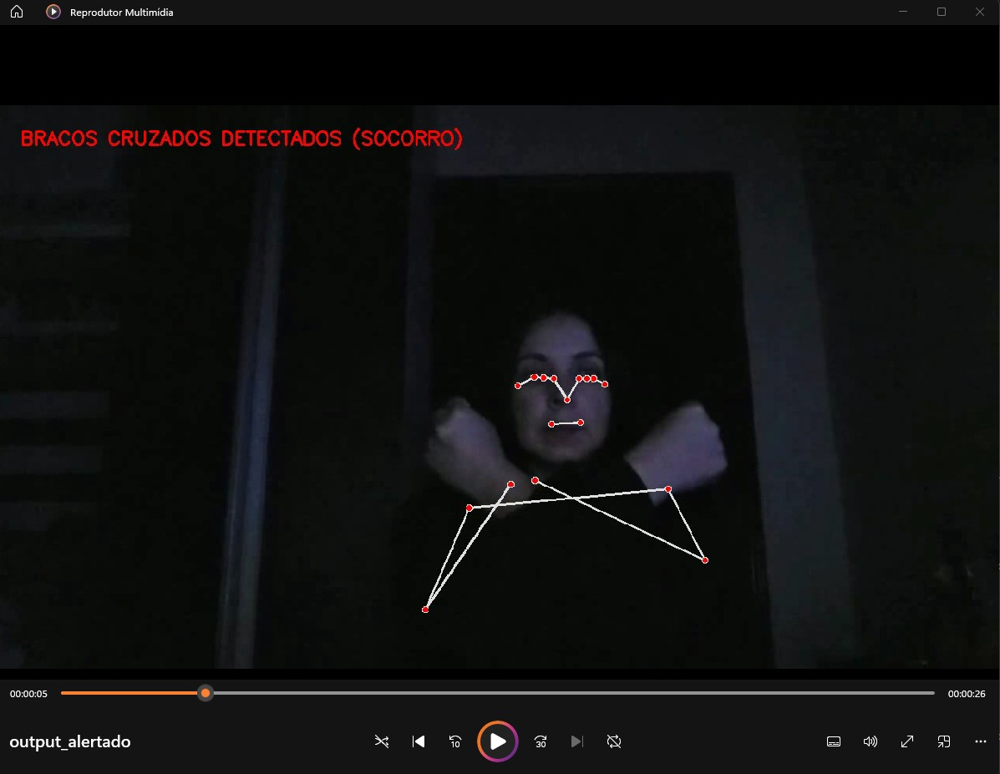

# Irana Pereira - RM98593
# Lucas Vinicius Candido - RM98480
# Mariana Melo – RM98121 
# Professor: Raphael Garcia Moreira
# Turma 3ESPV - Engenharia de Software


# SafeLight – Reconhecimento de Gestos em Situações de Apagão

## Descrição do Problema

Apagões podem gerar riscos à vida em ambientes críticos, especialmente onde há idosos, crianças ou pessoas com mobilidade reduzida. Em situações sem comunicação ou iluminação, gestos podem ser a única forma de pedir ajuda.

## Visão Geral da Solução

Desenvolvemos uma solução em Python utilizando o MediaPipe para detectar gestos em vídeo que indicam pedido de socorro ou ajuda direcionada. O sistema funciona com vídeos gravados, sem depender de hardware externo, webcam ou sensores.

###  Gestos reconhecidos:
- **Braços cruzados:** sinal de socorro
- **Braço direito levantado:** ajuda para mulher
- **Braço esquerdo levantado:** ajuda para homem

### Exemplo de funcionamento:


### 🎥 Vídeo demonstrativo:
[Assista aqui](https://youtu.be/kSCd8IuuFBY)

### ▶️ Instruções de uso:

1. Gravamos um vídeo com os gestos desejados como `video_teste.mp4`
2. Colocamos na mesma pasta do arquivo `safelight_multigestos.py`
3. Execute o script com:

```bash
python safelight_multigestos.py

#Código: O código está no arquivo safelight_multigestos.py.

# import cv2
# import mediapipe as mp
# import time

# # Inicializa o MediaPipe Pose
# mp_pose = mp.solutions.pose
# pose = mp_pose.Pose()
# mp_drawing = mp.solutions.drawing_utils

# # Lê vídeo gravado
# cap = cv2.VideoCapture('video_teste.mp4')

# # Define codec e cria objeto de escrita de vídeo
# fourcc = cv2.VideoWriter_fourcc(*'mp4v')
# fps = cap.get(cv2.CAP_PROP_FPS)
# width = int(cap.get(cv2.CAP_PROP_FRAME_WIDTH))
# height = int(cap.get(cv2.CAP_PROP_FRAME_HEIGHT))
# out = cv2.VideoWriter('output_alertado.mp4', fourcc, fps, (width, height))

# # Controle de inatividade
# last_movement_time = time.time()
# INACTIVITY_LIMIT = 60  # segundos

# # Função para detectar braços cruzados (socorro)
# def detect_arms_crossed(landmarks):
#     try:
#         lw = landmarks[mp_pose.PoseLandmark.LEFT_WRIST]
#         rw = landmarks[mp_pose.PoseLandmark.RIGHT_WRIST]
#         ls = landmarks[mp_pose.PoseLandmark.LEFT_SHOULDER]
#         rs = landmarks[mp_pose.PoseLandmark.RIGHT_SHOULDER]
#         return lw.x > rs.x and rw.x < ls.x
#     except:
#         return False

# # Função para detectar braço direito levantado (ajuda mulher)
# def detect_right_arm_raised(landmarks):
#     try:
#         rw = landmarks[mp_pose.PoseLandmark.RIGHT_WRIST]
#         re = landmarks[mp_pose.PoseLandmark.RIGHT_ELBOW]
#         rs = landmarks[mp_pose.PoseLandmark.RIGHT_SHOULDER]
#         return rw.y < re.y < rs.y
#     except:
#         return False

# # Função para detectar braço esquerdo levantado (ajuda homem)
# def detect_left_arm_raised(landmarks):
#     try:
#         lw = landmarks[mp_pose.PoseLandmark.LEFT_WRIST]
#         le = landmarks[mp_pose.PoseLandmark.LEFT_ELBOW]
#         ls = landmarks[mp_pose.PoseLandmark.LEFT_SHOULDER]
#         return lw.y < le.y < ls.y
#     except:
#         return False

# # Loop de processamento do vídeo
# while cap.isOpened():
#     ret, frame = cap.read()
#     if not ret:
#         break

#     img_rgb = cv2.cvtColor(frame, cv2.COLOR_BGR2RGB)
#     results = pose.process(img_rgb)

#     if results.pose_landmarks:
#         mp_drawing.draw_landmarks(frame, results.pose_landmarks, mp_pose.POSE_CONNECTIONS)
#         landmarks = results.pose_landmarks.landmark

#         # Ordem de prioridade: braço direito > esquerdo > cruzado
#         if detect_right_arm_raised(landmarks):
#             cv2.putText(frame, 'BRACO DIREITO LEVANTADO - AJUDA MULHER', (30, 50),
#                         cv2.FONT_HERSHEY_SIMPLEX, 0.8, (255, 0, 0), 2)

#         elif detect_left_arm_raised(landmarks):
#             cv2.putText(frame, 'BRACO ESQUERDO LEVANTADO - AJUDA HOMEM', (30, 50),
#                         cv2.FONT_HERSHEY_SIMPLEX, 0.8, (0, 255, 0), 2)

#         elif detect_arms_crossed(landmarks):
#             cv2.putText(frame, 'BRACOS CRUZADOS DETECTADOS (SOCORRO)', (30, 50),
#                         cv2.FONT_HERSHEY_SIMPLEX, 0.8, (0, 0, 255), 2)

#         last_movement_time = time.time()

#     elif time.time() - last_movement_time > INACTIVITY_LIMIT:
#         cv2.putText(frame, 'INATIVIDADE DETECTADA', (30, 80),
#                     cv2.FONT_HERSHEY_SIMPLEX, 1.0, (0, 165, 255), 3)

#     out.write(frame)

# cap.release()
# out.release()
# print("✅ Video gerado: output_alertado.mp4")

